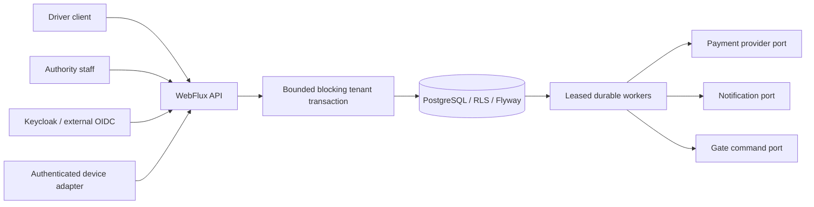
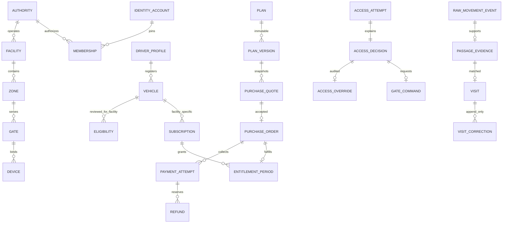

# Architecture and contracts

## Components



Capabilities are Java packages: identity, authority, driver, plan, billing, access, movement, operations; shared
contains only persistence/error/cryptographic infrastructure. Public service methods form module interfaces. No module
sends provider traffic while holding a database transaction. JPA handles immutable plan versions; JDBC handles explicit
constraints, reports and locks under the same transaction manager.

## Relational model



Every tenant aggregate has a composite `(tenant_id,id)` key; cross-aggregate references include tenant. Database tables
are in Flyway migration V1. Raw observations and passages remain separate. Visits are rebuildable projections;
corrections are append-only and exposed as effective exit timestamps.

## Purchase and recovery

```mermaid
sequenceDiagram
  participant D as Driver
  participant A as API
  participant DB as PostgreSQL
  participant W as Worker
  participant P as Provider
  D->>A: immutable quote + idempotency key
  A->>DB: order + CREATE_ORDER outbox (one transaction)
  W->>DB: claim; mark external write uncertain
  W->>P: create order (outside transaction)
  W->>DB: persist provider order mapping
  P->>A: signed raw payment webhook
  A->>DB: deduplicated event + VERIFY_PAYMENT outbox
  W->>P: fetch final payment
  W->>DB: validate; payment CAPTURED + order CONFIRMED + FULFILL
  W->>DB: lock subscription; append period; order FULFILLED + notification
  Note over W,DB: Crash before fulfillment commit retries safely by order unique key
```

## Gate access

```mermaid
sequenceDiagram
  participant D as Device
  participant A as Access API
  participant DB as PostgreSQL
  participant W as Gate worker
  participant G as Gate adapter
  D->>A: authenticated observation + stable source ID
  A->>DB: raw event; policy evaluation at injected backend clock
  A->>DB: attempt + reasoned decision + expiring command
  A-->>D: decision, next action, command identifier
  W->>DB: claim command once; mark DISPATCHED
  W->>G: bounded command with expiry
  D->>A: acknowledgement
  Note over A,DB: Acknowledgement does not create a visit
  D->>A: separate physical passage evidence
  A->>DB: raw event + passage + matching job
```

## Event recovery

```mermaid
sequenceDiagram
  participant D as Buffered device
  participant A as API
  participant DB as PostgreSQL
  participant W as Worker
  D->>A: buffered historical event
  A->>DB: exact retry hash check; preserve evidence
  Note over A,DB: No retrospective admission command
  A->>DB: passage + durable matching job
  W->>DB: claim with lease / SKIP LOCKED
  W->>DB: serialize vehicle-facility timeline
  W->>DB: rebuild visit projection; flag ambiguity; inbox + DONE
  Note over W,DB: Expired lease retries after restart
```

## Refunds

```mermaid
sequenceDiagram
  participant F as Finance maker
  participant C as Finance checker
  participant A as API
  participant DB as PostgreSQL
  participant W as Worker
  participant P as Provider
  F->>A: request amount, reason, idempotency key
  A->>DB: lock payment; reserve remaining balance
  C->>A: approve (different actor)
  A->>DB: APPROVED + REFUND job
  W->>DB: mark REVIEW before external write
  W->>P: create refund
  P-->>W: pending / processed / failed
  W->>DB: validate reference and amount; record independent refund state
  Note over W,DB: Only processed confirmation suspends subscription
  W->>P: lookup by receipt after ambiguous timeout; never blind POST retry
```

## State transitions

- Order: CREATED → REVIEW during provider creation → PENDING → CONFIRMED → FULFILLED. REVIEW requires receipt lookup or
  finance reconciliation.
- Payment: captured records are final, independently retained; late authorized/failed events never downgrade capture.
  Extra captures create a reconciliation finding without another entitlement.
- Entitlement: derived SCHEDULED / ACTIVE / EXPIRED, with separate subscription suspension and historical periods.
- Refund: REQUESTED → APPROVED → REVIEW → PENDING / PROCESSED / FAILED. Request reserves balance; provider processed
  confirmation determines success. Maker cannot approve own request.
- Command: PENDING → DISPATCHED → ACKNOWLEDGED / FAILED; PENDING expiry → EXPIRED, unacknowledged dispatched expiry →
  UNKNOWN. No automatic replay from terminal/ambiguous states.
- Outbox: READY → LEASED → DONE; failed lease processing → delayed READY, fifth failure → DEAD. Expired leases recover.
  Inbox keys guard consumer completion.

## API conventions

Version prefix `/api/v1`; tenant resources `/tenants/{tenantId}`. OIDC bearer token required except explicitly
authenticated provider/device boundaries and minimal health. JSON snake_case database response fields, camelCase request
DTO fields. DTO schemas and endpoints generated at `/v3/api-docs`, Swagger UI `/swagger-ui.html` (authenticated).
ProblemDetail errors have stable `code`, HTTP status and no SQL/secret detail. List page default 0, capped page sizes;
reports require facility and bounded time range. Financial amounts are integer minor units with currency, never binary
floats.

Idempotency keys are required for purchase, refund, reconciliation, fallback, override, support case, settlement,
corrections and retention redaction. Scope = tenant + actor + operation; mismatched payload is 409. Exact
provider/device transport retransmissions use trusted source identifiers and payload digests. A new device observation
ID is not a transport duplicate.
